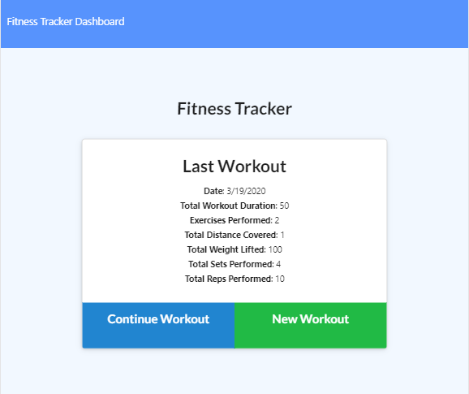
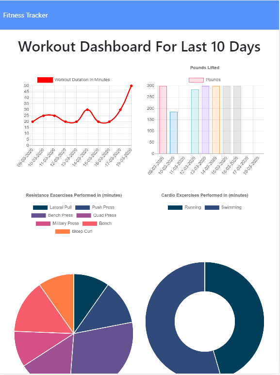

# WorkoutTracker
Workout Tracker able to view, create and track daily workouts

## User Story

* As a user, I want to be able to view create and track daily workouts. I want to be able to log multiple exercises in a workout on a given day. I should also be able to track the name, type, weight, sets, reps, and duration of exercise. If the exercise is a cardio exercise, I should be able to track my distance traveled.

## Business Context

A consumer will reach their fitness goals quicker when they track their workout progress.

-  Github
> https://github.com/JameskuttySebastian/WorkoutTracker

-  Heroku
> https://evening-bayou-84404.herokuapp.com/?id=5e7320869400ab0017b7bacc

## Technologies used

- HTML
- CSS
- Express
- Node
- MongoDB

### Home page
This page is for viewing last created exercise and adding exercises. There are two options

1. Add new exercise for the day (if it is a new day)
2. Continue existing workout by adding new type of workout to current exercise

### Add Exercise
This page is for entering workouts to the exercise. There are two type of workouts.
1. Resistance
2. Cardio

### Dashboard
This page is for viewing exercise history in different angle;
1. A line chart for workout duration in minutes
2. A bar chart showing pounds lifted
3. A pie chart showing exercise performed in minutes
4. A pie chart showing cardio exercise performed in minutes

